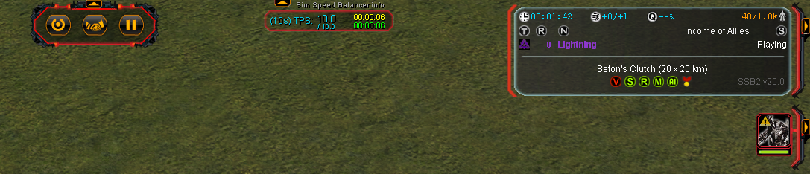

# Announcments

2026/4/28
Uploaded to FAF vault as "Sim Speed Balancer"

2026/5/1
Approved as a ranked mod for competitive matches

2026/6/3
Merged optional UI version and the mandatory SIM version into the same vault upload

---

Works with scoreboard mods like Supreme Scoreboard

# How does it work?

**_TLDR_**: Dynamically adjust game speed to reduce lag and improve performance.

---

**_Summary_**: Dynamically speed up **easy to compute ticks** right after **hard to compute ticks** to keep ingame-time and real-time in sync.

Supreme Commander's game state is calculated individually by every player in the lobby. The only information they give each other is the actions they _just_ did. This requires keeping the game state perfectly in sync across everybody and **no matter what happens**, this is the **highest priority**.

The game accomplishes this well! Every time someone's internet cuts out, packets miss, or their computer freezes for a moment. The entire simulation comes to a halt to wait for the them to catch up. If anyone is even a few milliseconds late on their tick calculations, the simulation slows down to meet them.

This occurs in single player matches as well

The game runs at 10 ticks per second, 100ms per tick. Here's a tick by tick theoretical:

Tick 1: 86ms (finished and waiting until 100ms)

Tick 2: 95ms (finished and waiting until 100ms)

Tick 3: 105ms (+5ms) -> **5ms behind** |-- too much action

Tick 4: 120ms (+20ms) -> **25ms behind** |-- too much action

Tick 5: 103ms (+3ms) -> **28ms behind** |-- too much action

-- turn on +1 speed to end ticks early at 90ms instead

Tick 7: 89ms (-10ms) -> **18ms behind** +1 speed |-- recapture lost time

Tick 8: 82ms (-10ms) -> **8ms behind** +1 speed |-- recapture lost time

Tick 9: 83ms (-10ms) -> **2ms ahead** +1 speed |-- recapture lost time

-- caught up so set to +0
Tick 10: 90ms (+0ms) -> **2ms ahead** +0 speed

The actual implementation has a 100ms threshold for falling behind before catching up, so it doesn't overshoot real-time.

Sometimes there are long periods of slowdown, rather than going slow for a minute and then speeding up the rest of the game. The mod is capped to 3 seconds by default. This means that if the simulation falls more than 3 seconds behind before it can catch up, it won't make that time up. This keeps the speedups more local, and can be adjusted through the ingame options.

Here is a basic comparison with the mod on vs off

0:00 - 3:00 it's off
3:00 - 6:19 it's on

https://youtu.be/BZkxeI3a9-c

---

# Features

• Stores slowdown time in a capped buffer that tries to make up lost time by increasing the game speed by 10%

• Manual player pauses are excluded from all calculations

• UI readouts next the clock with tooltips for what they mean

• Replay compatible

• The mod relies on game speed set to "adjustable" but blocks players from changing it. Turning cheats on allows overriding of the mod (setting speed back to 0 re-enables it)

• Some mod constants can be set in the lobby (1 for now)

• small scoreboard changes for readability

### Thanks!

Nuggets - FAF association (majorly helped with playtesting, feedback, and adoption)

---

# My initial proposal

### Lightningbulb — 4/23/2026 3:43 PM (DISCORD REPLY)

correct, my concept is that both simulation freezes from internet stutters or brief slowdowns from computation will adjust sim speed to make up at least some of the lost time.

The game runs at 10 ticks per second so 1 tick = 100ms

For full stops like internet stutters:

Increase the next 3-5 tick's speed substantially as players were already anticipating the movement (would give minor "zoop" forward) and if the time isn't made up, increase the sim speed by an extra tick for a few seconds to 11 ticks per second.

I'll have to test more, but some games don't appear to slow down, yet still stretch out by a few minutes and my guess is that any given slow tick can compound

Tick 1: 76ms (finished and waiting till 100ms)

Tick 2 86ms (finished and waiting till 100ms)

Tick 3: 95ms (finished and waiting till 100ms)

Tick 4: 102ms (2 ms late)

Tick 5: 120ms (20 ms late)

Tick 6: 98ms (finished and waiting till 100ms)

This depends on how FAF handles this though. It already has to do some automatic simspeed adjustments to keep people in sync (I think based on some console commands)

`wld_SkewRateAdjustBase` - How much to adjust the sim rate based on one beat of skew.

`wld_SkewRateAdjustMax` - Max amount to adjust the sim rate due to skew.

if it automatically syncs people to the slower speed on slow ticks (which would make sense) then we can add another tick per second for the following ticks that are easier to compute.

If the slowdown goes on for too long, then we would want to "expire" the lost time and it won't be made up, or there is just a maximum limit it can spend making up the lost time (5 seconds or so)

Of course this won't help if someone's cpu is completely bogged down and can't compute any easy ticks faster. Also, none of these numbers are exact and you would want to tune them to feel right, but that's the general concept. (edited)Thursday, April 23, 2026 3:48 PM

### Grandpa Sawyer — 4/23/2026 3:50 PM (DISCORD)

Assuming this can be pulled off without fault, it might be worth testing via FAF Develop for several matches.

Like, it sounds intriguing at first, but ultimately it comes down how it performs in practice.
